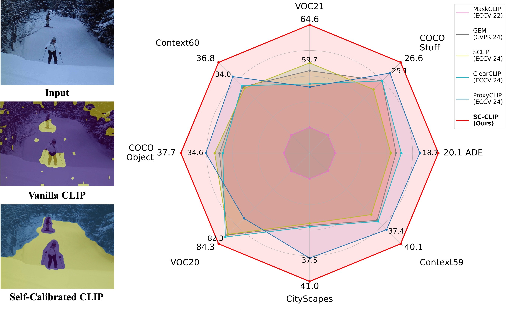

# Self-Calibrated CLIP for Training-Free Open-Vocabulary Segmentation

[Sule Bai*](https://sulebai.github.io/), [Yong Liu*](https://yongliu20.github.io/), [Yifei Han](https://github.com/LambdaGuard), [Haoji Zhang](https://zhang9302002.github.io/), [Yansong Tang](https://andytang15.github.io/)
(* denotes equal contribution)

**Official PyTorch Implementation of [Self-Calibrated CLIP for Training-Free Open-Vocabulary Segmentation](https://arxiv.org/abs/2411.15869)** 

<a href='https://arxiv.org/abs/2411.15869'></a> 

<div align="center">

</div>

## Abstract
> Recent advancements in pre-trained vision-language models like CLIP, have enabled the task of open-vocabulary segmentation. CLIP demonstrates impressive zero-shot capabilities in various downstream tasks that require holistic image understanding. However, due to its image-level pre-training, CLIP struggles to capture local details, resulting in poor performance in segmentation tasks. Our analysis reveals that anomaly tokens emerge during the forward pass, drawing excessive attention from normal patch tokens, thereby diminishing spatial awareness. To address this issue, we propose Self-Calibrated CLIP (SC-CLIP), a training-free method that calibrates CLIP to produce finer-grained representations while preserving its original generalization ability, without introducing new parameters or relying on additional backbones. Specifically, we first identify and resolve the anomaly tokens to mitigate their negative impact. Next, we enhance feature discriminability and attention correlation by leveraging the semantic consistency found in CLIP's intermediate features. Furthermore, we employ multi-level feature fusion to enrich details. Collectively, these strategies enhance CLIP's feature representation with greater granularity and coherence. Experimental results demonstrate the effectiveness of SC-CLIP, achieving state-of-the-art results across eight semantic segmentation datasets and surpassing previous methods by 9.5%. Notably, SC-CLIP boosts the performance of vanilla CLIP ViT-L/14 by 6.8 times.

## Dependencies

```
git clone https://github.com/SuleBai/SC-CLIP.git
cd SC-CLIP

conda create -n scclip python=3.9
conda activate scclip
pip install torch==1.10.1+cu111 torchvision==0.11.2+cu111 -f https://download.pytorch.org/whl/cu111/torch_stable.html
pip install openmim
mim install mmcv==2.0.1 mmengine==0.8.4 mmsegmentation==1.1.1
pip install ftfy regex numpy==1.26 yapf==0.40.1
```

## Datasets
We provide the dataset configurations in this repository, following [SCLIP](https://github.com/wangf3014/SCLIP).

Please follow the [MMSeg data preparation document](https://github.com/open-mmlab/mmsegmentation/blob/main/docs/en/user_guides/2_dataset_prepare.md) to download and pre-process the datasets. The COCO-Object dataset can be converted from COCO-Stuff164k by executing the following command:

```
python ./datasets/cvt_coco_object.py PATH_TO_COCO_STUFF164K -o PATH_TO_COCO_OBJECT
```

## Quick Inference
```
python demo.py
```

## Model Evaluation
Single-GPU running:

```
python eval.py --config ./configs/cfg_DATASET.py --workdir YOUR_WORK_DIR
```

Multi-GPU running:
```
bash ./dist_test.sh
```

## Acknowledgement
This implementation is based on [CLIP](https://github.com/openai/CLIP), [SCLIP](https://github.com/wangf3014/SCLIP), [CLIP-DINOiser](https://github.com/wysoczanska/clip_dinoiser) and [ClearCLIP](https://github.com/mc-lan/ClearCLIP). Thanks for the awesome work.